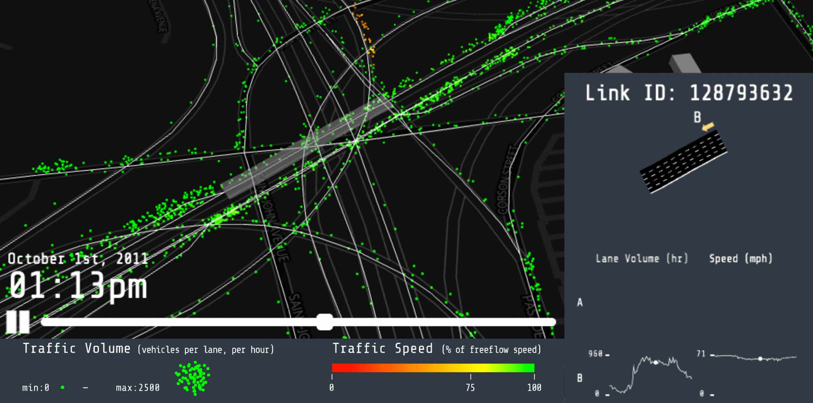
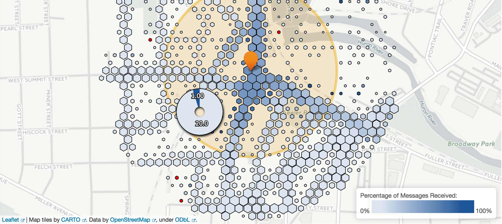
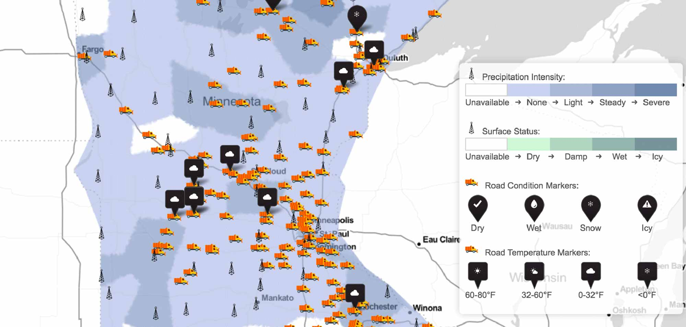
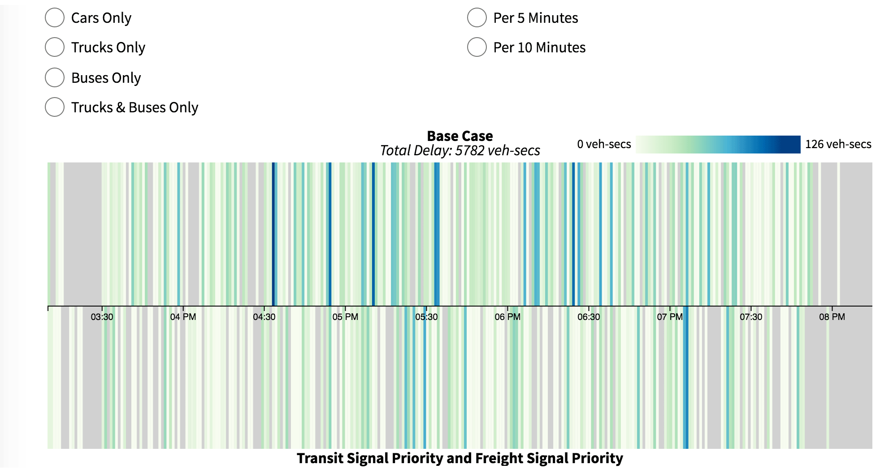
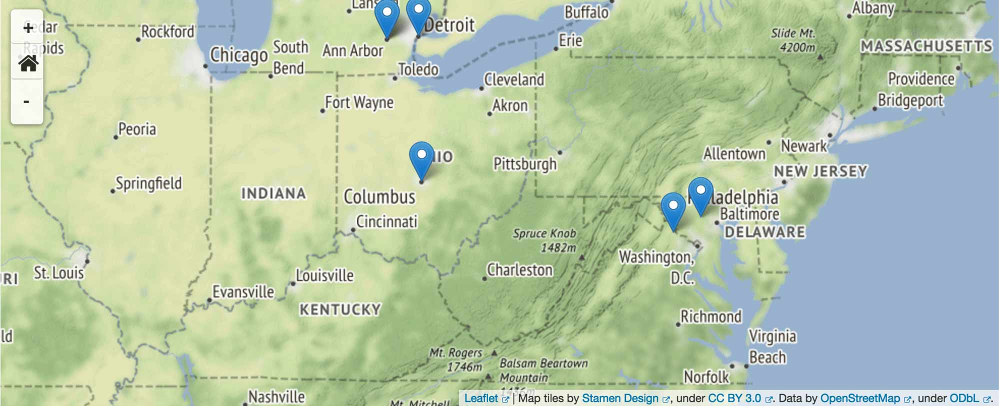
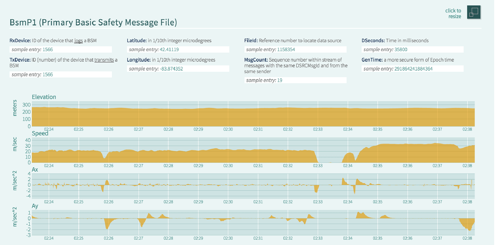

# RDE Visualization Website
This repository contains code and other assets to render a website displaying prototype visualizations of selected data sets in the [Federal Highway Administration](https://www.fhwa.dot.gov/) (FHWA)'s [Research Data Environment](https://www.its-rde.net/) (RDE).  These visualizations are designed to give researchers and data aficionados ideas for projects using the data on the RDE; they also strive to provide concrete examples of how large, complex data sets can be distilled into useful products.

## Installation and Use

Clone this repository and enter the repository root; for example:

```
git clone https://github.com/FHWA/RDE-Visualization-Website.git
cd RDE-Visualization-Website
```

You will need to run an HTTP server that supports Content-Range headers (i.e., not Python's `SimpleHTTPServer`/`http.server`) in the repository root.  For, example, using node.js' [http-server](https://github.com/indexzero/http-server):

```
http-server -p 8080
```

Now, you should be able to navigate [here](http://localhost:8080) to view the site.

## Visualization Elements

The site is divided into 6 visualization elements, each designed to emphasize a particular aspect of the data environments on the RDE.  Each visualization element page includes the visualization, a short description of the methodology and technologies used, and download instructions for the code and scripts used to create the visualization.

### Element 1: Characteristics of Transportation Systems

The Pasadena data environment in the RDE contains road-link level simulated traffic data for a period of several months in 2011. The visualization shows simulated traffic for the 24-hour period of October 1st, 2011, around a busy part of town.  The visualization uses [BabylonJS](http://www.babylonjs.com/) for 3D graphics.

### Element 2: Connected Vehicle Communication

The Federal Highway Administration's Connected Vehicle Safety Pilot Program studies the utility and effectiveness of communicating safety data between vehicles and roadside equipment (RSE). The visualization focuses on a single RSE and plots the quality and quantity of data received by the equipment from vehicles with on-board devices capable of broadcasting safety data.  Utilizes [Leaflet](http://leafletjs.com/) for mapping and [d3](https://d3js.org/) for displaying data and making charts.

### Element 3: Impact of Weather

The Federal Highway Administration also maintains the [Weather Data Environment](https://wxde.fhwa.dot.gov/), known as the WxDE, which is a repository of traffic-related weather data that can be used in research. Visualization element 3 combines data from the WxDE with data from the Minnesota DOT Mobile Observation data environment, on the RDE, to show weather, movement of snowplows, and road conditions during a blizzard in February of 2014.  It uses [WebGL](https://en.wikipedia.org/wiki/WebGL) to visualize data over a [Leaflet](http://leafletjs.com/) map.

### Element 4: Effect of Interventions

Multi-Modal Intelligent Traffic Signal Systems (MMITSS) is a technology that allows traffic signals to communicate with vehicles and possibly behave differently for different types of vehicles. For example, freight trucks may trigger traffic lights to turn green in an effort to reduce congestion. Element 4 provides an interactive interface for looking at the difference in traffic during a MMITSS field test in Anthem, Arizona.  Uses [d3](https://d3js.org/) to draw charts.

### Element 5: Exploring the RDE

The RDE contains a variety of data environments totaling over 300 Gigabytes of compressed data. Element 5 is an interactive dashboard that allows users to explore the datasets available in the RDE. By filtering on attributes of the dataset, it is easy to narrow the list of 161 down to those matching your interests.  This is a [dc.js](https://dc-js.github.io/dc.js/) dashboard that includes a [Leaflet](http://leafletjs.com/) mapping component.

### Element 6: Breadth and Depth of Connected Vehicle Data

While visualization element 5 presents the depth of data available in the RDE, Element 6 presents a view into the breadth of data that is available in one of the many RDE data environments. Element 6 is an interactive visual overview of the Basic Safety Message data set in the Safety Pilot Model Deployment data enviroment that logs vehicles' attempts to communicate with roadside equipment, as also shown in Element 2.  Utilizes [d3](https://d3js.org/) for charting.

### Data Preparation
See the [RDE-Visualization-Support](https://github.com/FHWA/RDE-Visualization-Support) repository for the scripts used to create the data files used for these visualizations.

### Technology Stack
Visualization libraries:
- d3.js
- dc.js
- Leaflet
- BabylonJS

### Release History:
- 0.0.1: Public release
